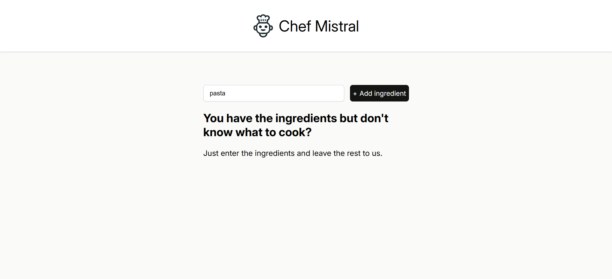
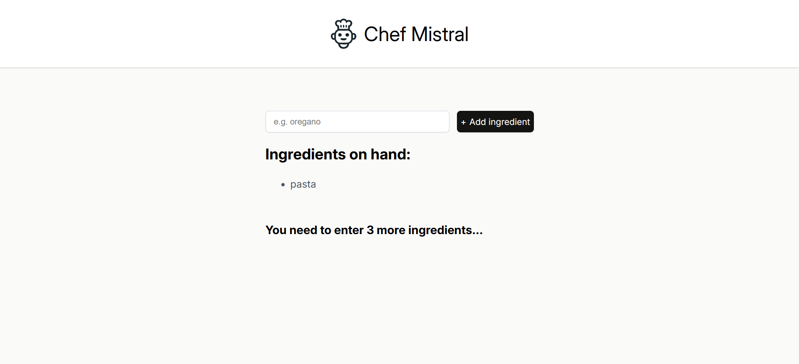
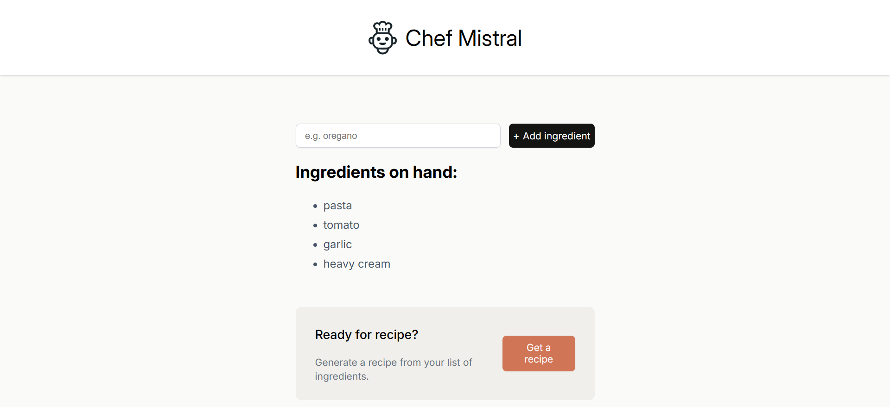
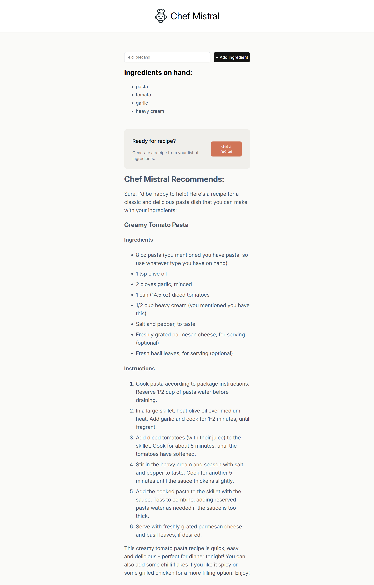

# Chef Mistral - AI-Powered Recipe Generator 🍲🧑‍🍳 
Chef Mistral is a modern React web app that helps you cook up meals using only the ingredients you have in the fridge! Just enter your ingredients, and let our friendly AI chef do the rest. Powered by the **Mistral Mixtral-8x7B** model via Hugging Face

## Features

- Add your own ingredients interactively
- Instant feedback on how many ingredients are needed to unlock recipe generation
- UI with clear, full-responsive design
- AI-generated recipes formatted in Markdown
- Accessibility-first approach (`aria-live`, semantic tags)
- Secure integration with the Hugging Face API

## Technologies Used

- **React** (Props, State, Conditional Rendering)
- **JavaScript (ES6+)**
- **Vite** (for modern fast dev environment)
- **CSS** (clean UI styling)
- **Markdown Rendering** via `react-markdown`
- **Hugging Face Inference API** (Mistral Model)

## How to run locally 

**1. Clone the repository:**  
    - git clone https://github.com/filipdev3/recipe-app.git

**2. Navigate into the project directory:**  
    - cd chef-mistral

**3. Install dependencies:**  
    - npm install

**4. Create .env file in the root directory and set the variable:**  
    - VITE_HF_ACCESS_TOKEN=your_huggingface_token

**5. Start the development server:**  
    - npm run dev 

## Application preview

**Starting page**  
This is how application looks like when user runs it.  

**Adding ingredients**  
User can simply add ingredients by entering name of the ingredient and clicking "+Add ingredients" button or hitting enter on keyboard.  

**Ingredients on hand**  
User needs to enter at least 4 ingredients to unlock "Get a recipe" button, otherwise application will display how many more ingredients the user needs to enter to be able to generate the recipe.  

**Ready for recipe**  
Once user enters sufficient amount of ingredients, he will be able to generate the recipe i.e. "Get a recipe" button will be unlocked.  

**Recipe generated**  
When user clicks "Get a recipe" button the app will contact the AI ​​Mistral model via the API and generate a recipe based on the given ingredients.  
